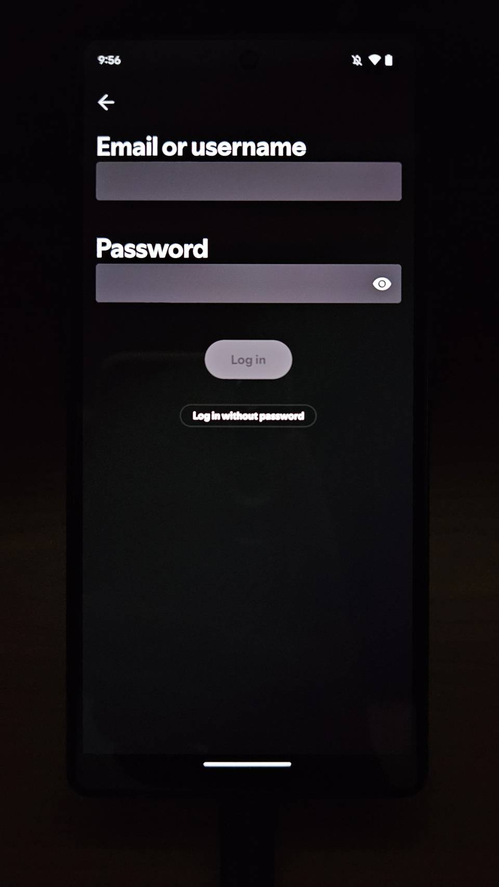

# fetchXPATH
## Introduction
一般如果想要得到一個app的activity view XPATH，可以利用[Appium Inspector](https://github.com/appium/appium-inspector/releases)，但那建立在該app的activity可以screenshot的情況下，但是現在有越來越多的[app的某些activity在出廠設定的時候會被developer設定無法screenshot](https://www.reddit.com/r/pixel_phones/comments/xbtrg2/disabled_by_your_admin_on_a_screenshot/)，一般會發生在[銀行方面的app](https://www.esunbank.com/zh-tw/about/faq/content?q=mobile/056)，那些app其實會有一些config功能讓screenshot功能打開，或者是[利用其他方式bypass](https://www.softwaretestinghelp.com/fix-for-error-cant-take-screenshot-due-to-security-policy/)，不過像是Spotify這樣的app，在login activity的地方就無法screenshot也沒有任何方式可以調整config，因此就自己寫了一個program，得到特定的view XPATH
## Prerequisites
1. 一定要先在手機上安裝要inspect的app
2. Install Module
    ```bash
    $ pip install uiautomator2
    ```
3. 在`./fetchXPATH.py`中設定app_name
4. 可以使用adb
## How to use
直接執行就可以了，輸出會把現在畫面中所有的view XPATH印出來
```bash
$ python fetchXPATH.py
```
1. 以登入首頁為例
    
    ```bash
    $ python fetchXPATH.py
    Clickable View XPATH:  //android.widget.Button[@index='0' and @text='Sign up free' and @package='com.spotify.music' and @clickable='true']
    Clickable View XPATH:  //android.widget.Button[@index='1' and @text='Continue with Google' and @package='com.spotify.music' and @clickable='true']        
    Clickable View XPATH:  //android.widget.Button[@index='2' and @text='Continue with Facebook' and @package='com.spotify.music' and @clickable='true']      
    Clickable View XPATH:  //android.widget.Button[@index='3' and @text='Log in' and @package='com.spotify.music' and @clickable='true']
    ```
2. 以填入帳密的activity為例
	
    ```bash
    $ python fetchXPATH.py
    Clickable View XPATH:  //android.widget.EditText[@index='1' and @resource-id='com.spotify.music:id/username_text' and @package='com.spotify.music' and @clickable='true']
    Clickable View XPATH:  //android.widget.EditText[@index='0' and @resource-id='com.spotify.music:id/password_text' and @package='com.spotify.music' and @clickable='true']
    Clickable View XPATH:  //android.widget.ImageButton[@index='0' and @resource-id='com.spotify.music:id/text_input_end_icon' and @package='com.spotify.music' and @content-desc='Show password' and @clickable='true']
    Clickable View XPATH:  //android.widget.Button[@index='5' and @text='Log in' and @resource-id='com.spotify.music:id/login_button' and @package='com.spotify.music' and @clickable='true']
    Clickable View XPATH:  //android.widget.Button[@index='6' and @text='Log in without password' and @resource-id='com.spotify.music:id/request_magiclink_lower_button' and @package='com.spotify.music' and @clickable='true']
    Clickable View XPATH:  //android.widget.ImageView[@index='2' and @resource-id='com.spotify.music:id/back_button' and @package='com.spotify.music' and @content-desc='Back' and @clickable='true']
    Editable View XPATH:  //android.widget.EditText[@index='1' and @resource-id='com.spotify.music:id/username_text' and @package='com.spotify.music' and @clickable='true']
    Editable View XPATH:  //android.widget.EditText[@index='0' and @resource-id='com.spotify.music:id/password_text' and @package='com.spotify.music' and @clickable='true']
    ```
